### Location-aware messaging to automatically notify those closest to you that you’ve made it somewhere safely

_What is it? How does it work?_

When you arrive somewhere (like when you finish a plane, train, or long car ride), it’s important to tell the ones that care about you that you have made it there safely. This app will make this process easier by asking to send an update to various important people via text, email, facebook message, etc.

For more information, see the design specification here: [http://1drv.ms/1FqmfVF](http://1drv.ms/1FqmfVF)

Source code available here: [https://github.com/DreaminDani/Android/tree/master/ImHereFinal](https://github.com/DreaminDani/Android/tree/master/ImHereFinal)

# Features and Specification

_Implementation Details_

Upon arrival in a certain location ([TripIt integration](https://www.tripit.com/developer)), a push notification will ask the user if they would like to send a message telling others that they have arrived there safely. If the user clicks it, the application will appear – showing a list of people ordered from most important to least important (algorithm pending – most likely will depend on Facebook integration and/or Recent Contacts). People who the user has sent previous messages to will already be checked and others may be selected as well. There will be options available for how the message should be sent (FB message, sms, etc.) and what data should be included in the message (GPS location, pre-filled text, location typed out, etc.). Default values for these options will be friendly enough to send with just a few clicks.

# Design and Use

The application consists of three components:

*   Trigger-location management
*   ImHere group management
*   Location-triggered services

To use the application, simply click on the icon after it has been installed:

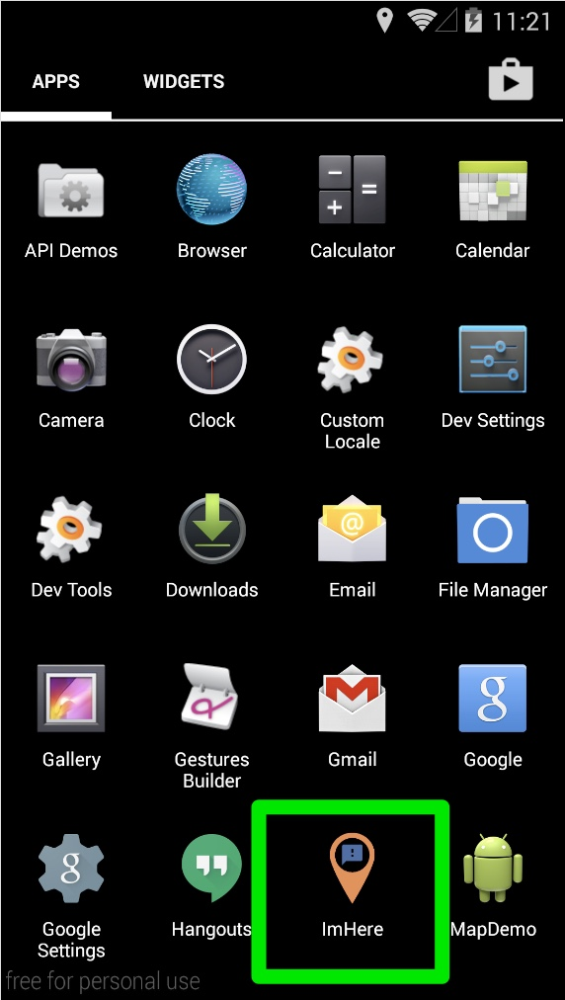

The application will open up to the main screen:

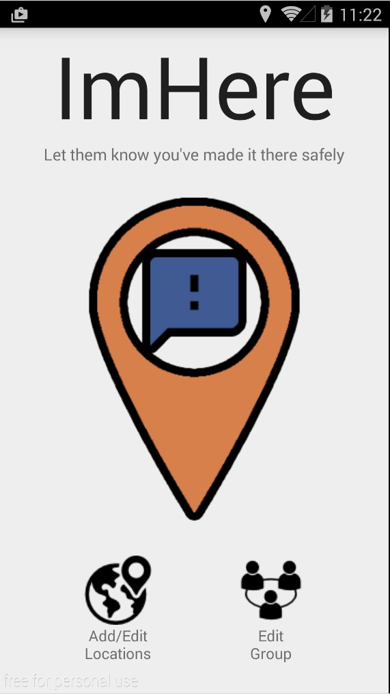

From here, the user can tap “Edit Group” to add contacts to a list that will appear when a user has reached a certain location or travelled over 100 miles between GPS-checkins:

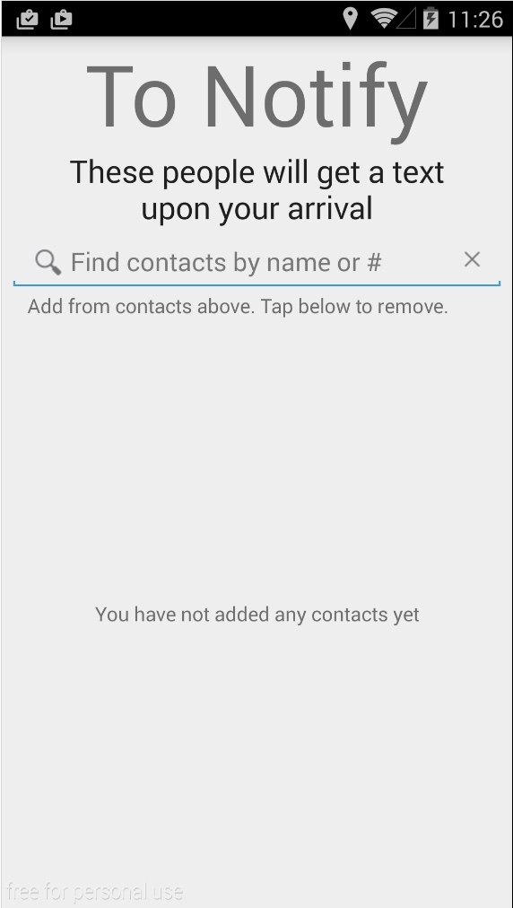

Contacts can be added to the list by name or by number. One can also tap to remove the contact from this list:

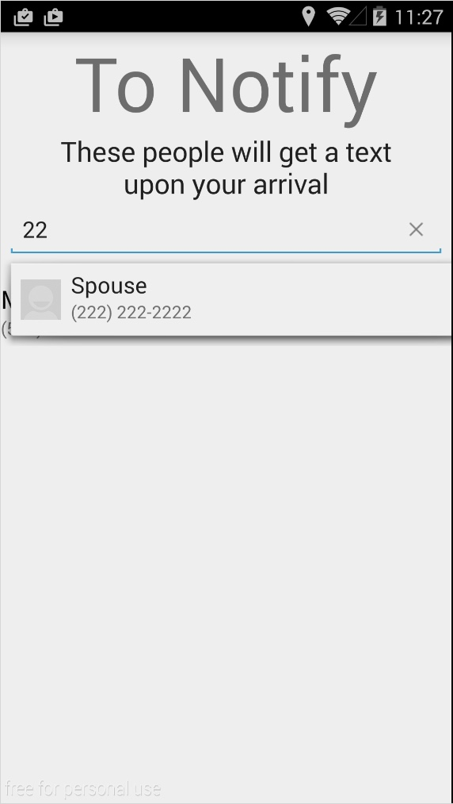

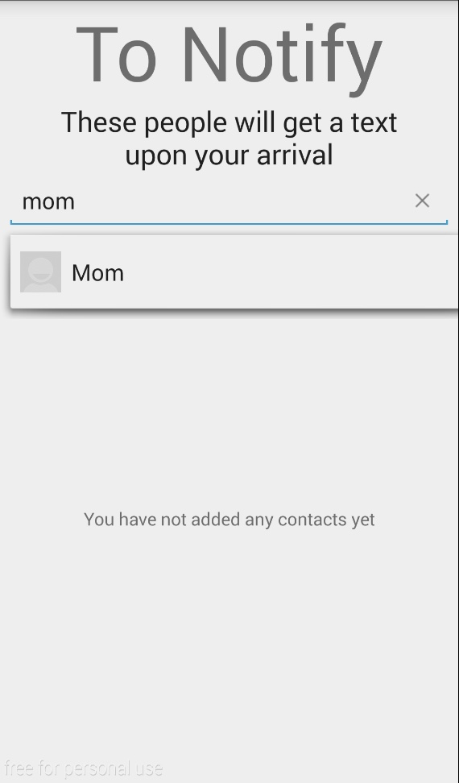

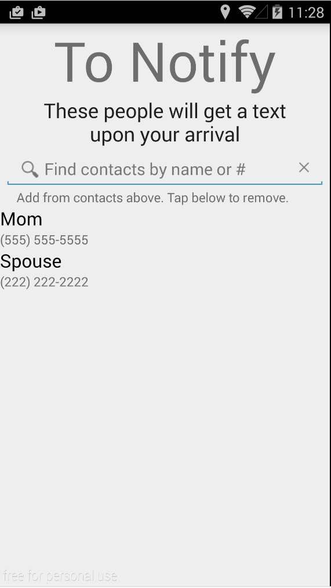

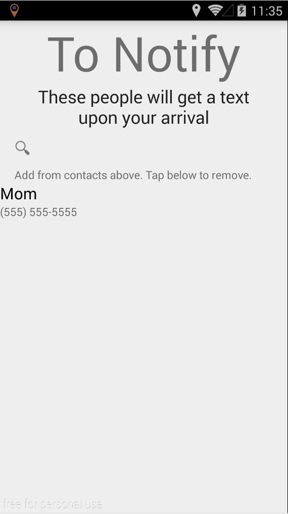

Clicking on Add/Edit Locations brings the user to the “Edit Custom Locations” screen. This screen allows them to set a spot where they would like ImHere to be aware of:

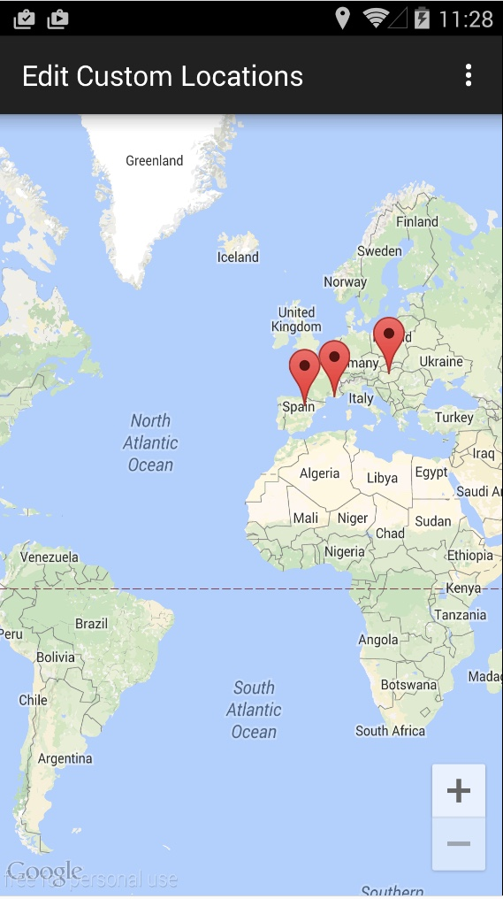

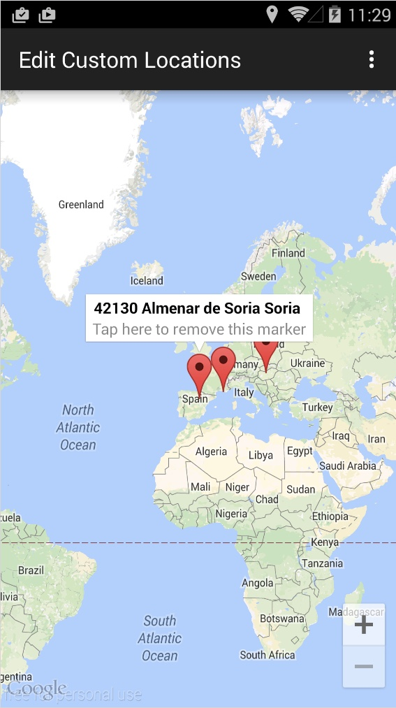

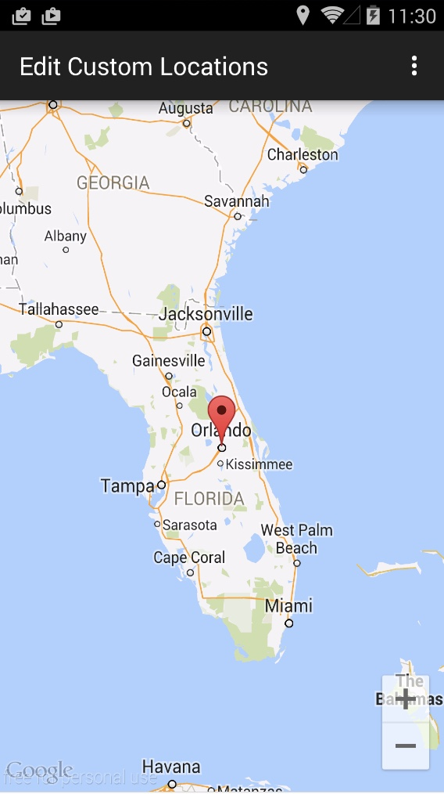

Upon arriving at a custom location **or after traveling over 100 miles between check-ins**, the user will receive a notification from ImHere:

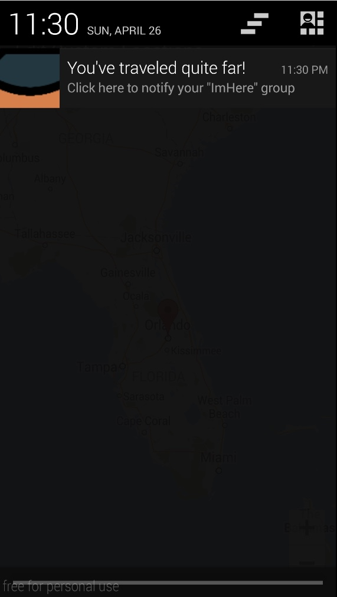

Clicking on the notification brings the user to the following screen, which shows a preview of the ImHere message and the group that it will be sent to:

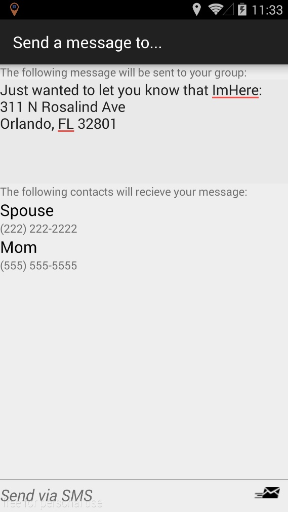

Clicking “Send via SMS” takes the user to their messaging application, the message already written out:

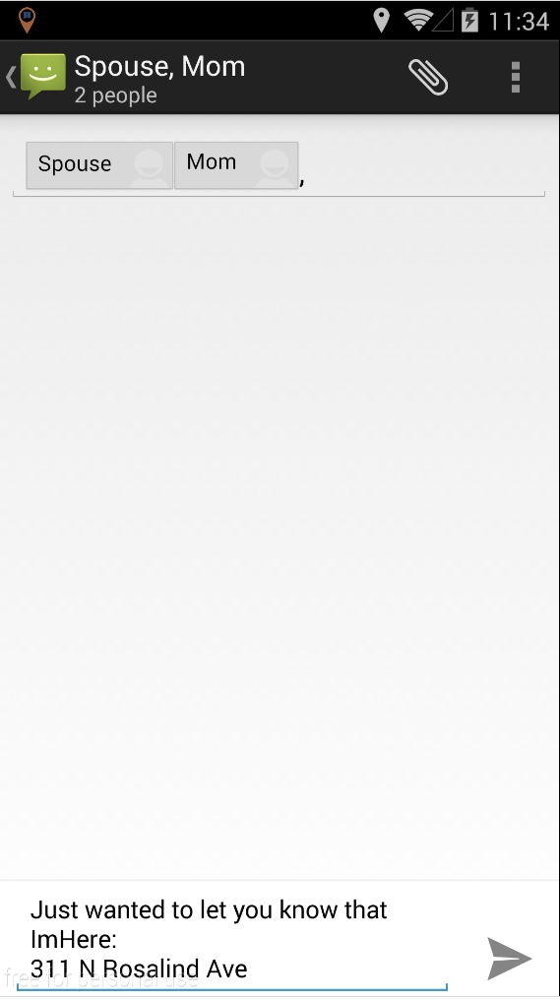

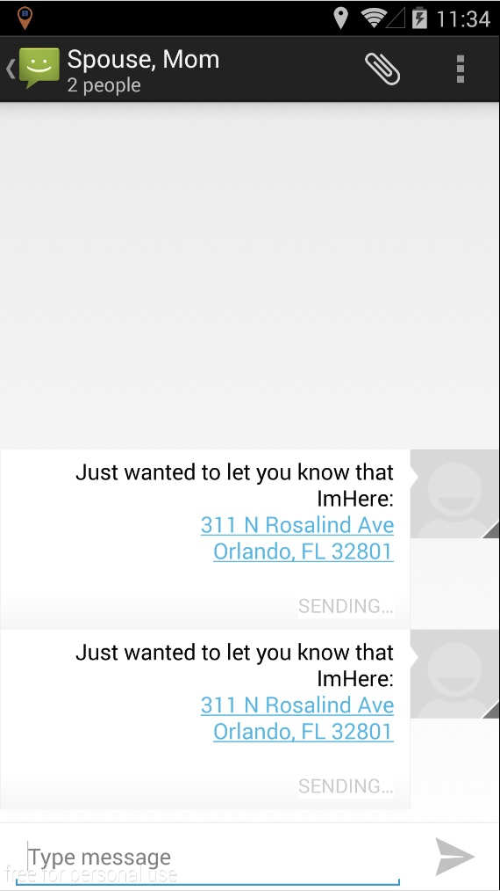

# Future Integrations

_To be implemented if I have time, otherwise, will be developed outside the class_

* Automatic check-in at locations (for posts on various social networking sights)
* Other messaging integrations (WhatsApp, Viber, etc.)
* Various other toggles for the push notification – like GoogleNow integration for telling people you showed up for work late.
* Changing the default recipient list depending on type of travel (not sure how to do this. Define: type of travel)

The entire specification is located here: [http://1drv.ms/1FqmfVF](http://1drv.ms/1FqmfVF)

For source code and package, head to my Android github: [https://github.com/DreaminDani/Android/tree/master/ImHereFinal](https://github.com/DreaminDani/Android/tree/master/ImHereFinal)

