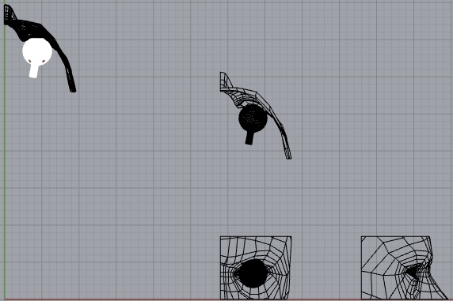
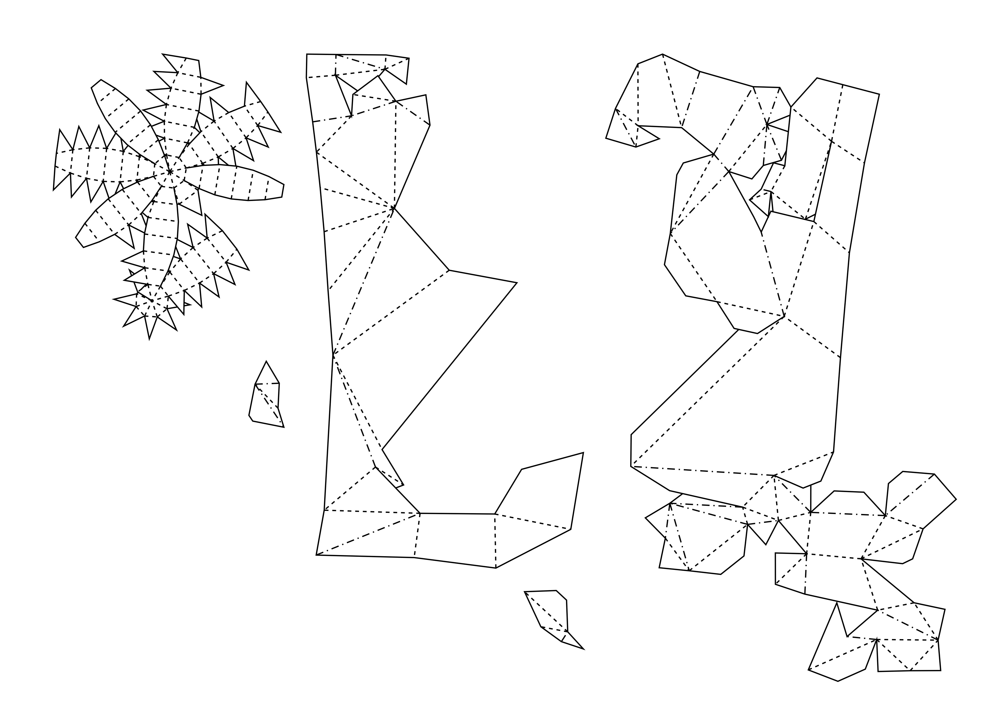
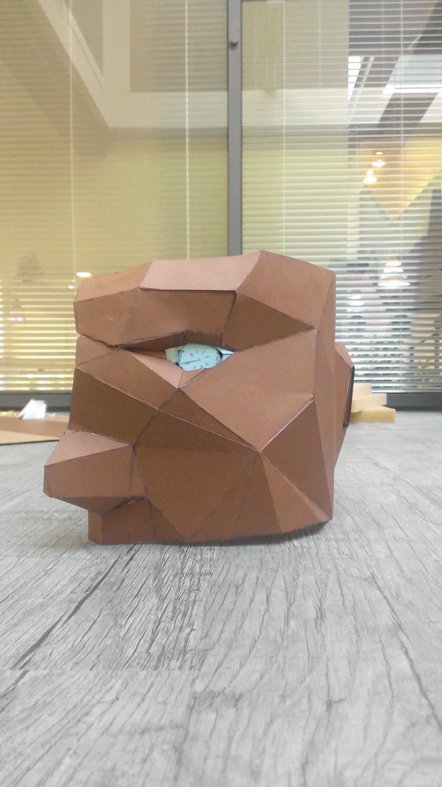
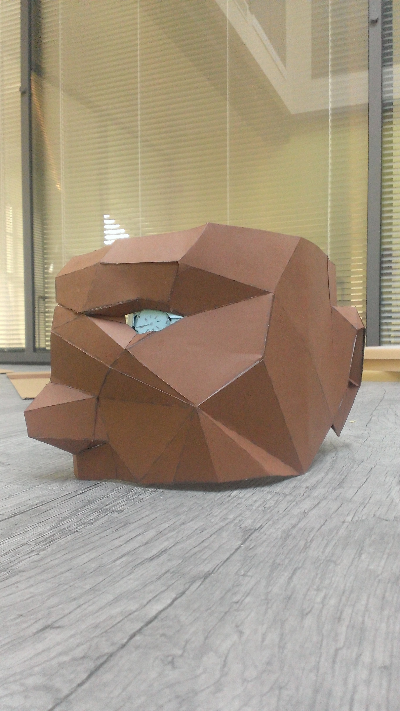
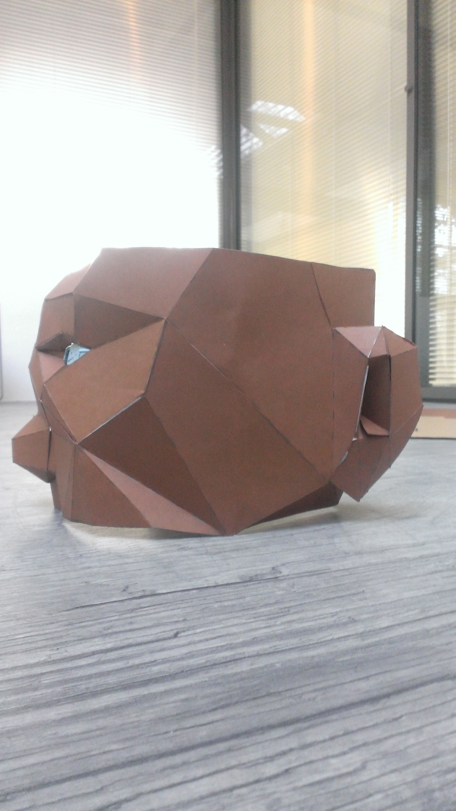
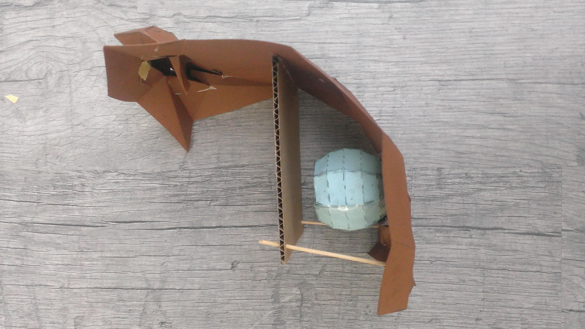
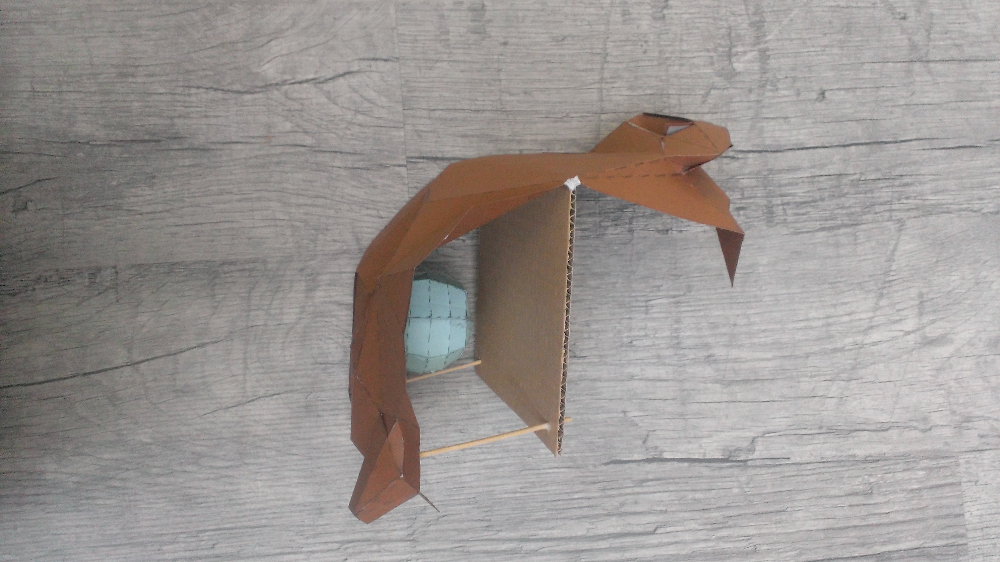

Using an open-source model of a face and eye, I combined the two shapes in Rhinoceros:

After reducing the amount of polygons to a more manageable level, I imported the model into a tool called [Pepakura](http://www.tamasoft.co.jp/pepakura-en/). This converted the .3dm file into a foldable shape:

 

I then projected the design onto a large piece of construction paper – allowing me to build a larger-than-life size model:

