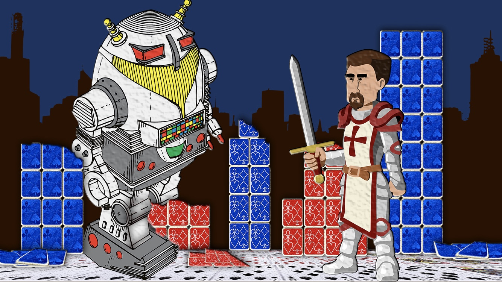
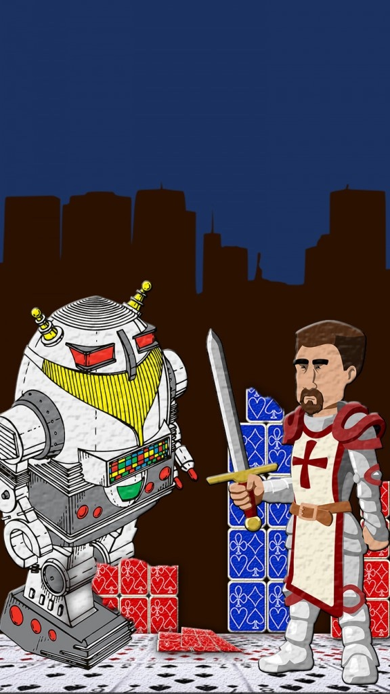

Developers Tom Dobrow and Jack Reuter presented the following guidelines:
- A Human and a Robot Fighting
- Something to do with Cards and/or Bridge

After a bit of brainstorming and thematic discussion, I came up with the following horizontal design:

After review, my clients returned with a request to make the image into a vertical orientation as well as generate a background for the entire application with a similar theme.

I provided the following images in response:

All images are from [PixaBay](https://pixabay.com/) – no attribution required.