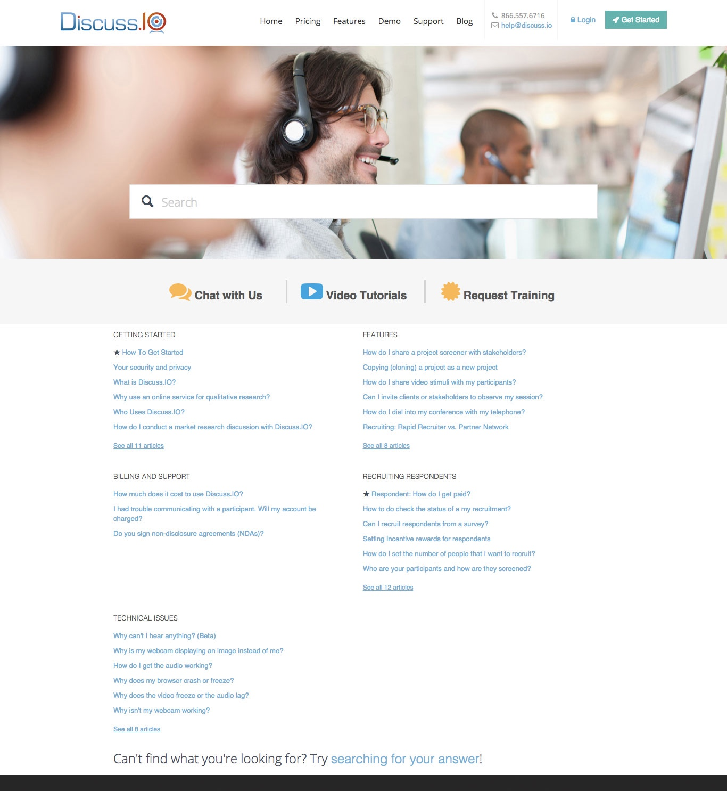

After a disappointing turnout towards [Discuss.IO](https://discuss.io)‘s UserVoice Knowledge Base, the marketing team decided to re-engineer our collection of support articles. I converted all of our internal support content from the company wiki into customer-facing documentation. I also kept the website up to date with new content through posts under my own name and Zach (CEO).

Through a series of screenshots, step-by-step instructions and easy-to-read language, I was able to create help.discuss.io – a general knowledge base which I designed and maintained. The design is based off a search-first model that encourages users find what they are looking for via a search bar at the top of the page, instead of having to navigate through lists.

This content has since been replaced by support.discuss.io

